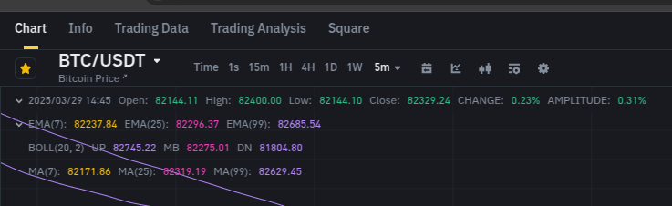

# Logs do BotDev 2025

Este documento contém os logs gerados pelo bot durante sua execução, incluindo informações sobre operações, erros e monitoramento.

---

Passo a Passo para Rodar o BotDev 2025
Este guia detalha como configurar e executar o bot de trading automatizado desenvolvido para interagir com a API da Binance.

1. Pré-requisitos
Antes de começar, certifique-se de que você tenha os seguintes itens instalados:

Node.js : Ambiente de execução JavaScript.
Download
Git : Ferramenta para controle de versão.
Download
Editor de Código : Recomendamos o VS Code.
Download
Chaves de API da Binance :
Acesse sua conta na Binance e gere uma chave de API (API_KEY) e uma chave secreta (SECRET_KEY).
Certifique-se de que as chaves estejam habilitadas para operações de trading.

2. Clonar o Repositório
Clone o repositório do projeto para sua máquina local:

git clone https://github.com/seu-usuario/botdev2025.git
cd botdev2025

3. Instalar Dependências
npm install

4. Configurar Variáveis de Ambiente
Crie um arquivo .env na raiz do projeto e adicione as seguintes variáveis:
BINANCE_API_KEY=SUA_API_KEY_AQUI
BINANCE_SECRET_KEY=SUA_SECRET_KEY_AQUI
GITHUB_WEBHOOK_SECRET=SEU_TOKEN_SECRETO_PARA_WEBHOOK

Nota: Substitua SUA_API_KEY_AQUI, SUA_SECRET_KEY_AQUI e SEU_TOKEN_SECRETO_PARA_WEBHOOK pelos valores reais. Nunca compartilhe suas chaves de API publicamente. 

5. Configurar o Webhook (Opcional)
Se você deseja usar o webhook para atualizar automaticamente o bot via GitHub, siga estas etapas:

No repositório do GitHub, vá para Settings > Webhooks > Add Webhook .
Configure o URL como http://SEU_IP_OU_DOMINIO:8080/webhook.
Insira o mesmo token secreto usado no arquivo .env.
Escolha Just the push event ou selecione eventos específicos.
Salve o webhook.

6. Executar o Bot
Você pode iniciar o bot usando um dos seguintes comandos:

Modo de Desenvolvimento

npm start

Modo de Produção com PM2
Para rodar o bot em segundo plano e garantir que ele continue funcionando após reinicializações:

Instale o PM2 globalmente:
npm install -g pm2

Inicie o bot com o PM2:
pm2 start index.js --name bot-binance

Verifique os logs do bot:
pm2 logs bot-binance

Para reiniciar o bot após atualizações:
pm2 restart bot-binance

## Logs de Operação

### Comportamento Observado
O bot está tentando realizar operações de venda (`SELL`) após detectar que o lucro/prejuízo foi atingido. No entanto, as ordens estão falhando devido a um erro de assinatura (`code: -1022`).

#### Exemplo de Logs

📌 Preço Atual: 95261.58
📉 RSI: 38.71
📊 ATR: 39.83
🤖 Já comprei? true
📈 Lucro estimado: -0.31%
💰 Saindo da posição: lucro/prejuízo atingido com taxa incluída
💰 Saldo USDT: 0.10558975 | Saldo BTC: 0.00008991
📌 Tentando SELL 0.00009 BTC a 95261.58 USDT
🚨 Venda falhou! Tentará novamente na próxima verificação.


---

## Erros Identificados

### Erro de Assinatura (`code: -1022`)
Este erro ocorre quando a assinatura HMAC-SHA256 gerada pelo bot não é válida para a API da Binance. Abaixo estão os logs detalhados:

#### Exemplo de Erros

🚨 Erro na ordem: { code: -1022, msg: 'Signature for this request is not valid.' }
🚨 Erro na ordem: { code: -1022, msg: 'Signature for this request is not valid.' }
🚨 Erro na ordem: { code: -1022, msg: 'Signature for this request is not valid.' }
...


---

## Possíveis Causas

1. **Parâmetros Não Ordenados**:
   - A API da Binance exige que os parâmetros sejam ordenados alfabeticamente antes de gerar a assinatura.

2. **Timestamp Desatualizado**:
   - O timestamp usado na requisição deve estar atualizado e dentro da margem de tolerância (geralmente ± 1 segundo).

3. **Chaves de API Inválidas ou Expiradas**:
   - Certifique-se de que suas chaves de API (`API_KEY` e `SECRET_KEY`) estejam corretas e habilitadas para operações de trading.

4. **Erro na Geração da Assinatura**:
   - A assinatura deve ser gerada usando a chave secreta (`SECRET_KEY`) e os parâmetros ordenados.

---

## Soluções Propostas

### 1. Ordenação de Parâmetros
Certifique-se de que os parâmetros da requisição sejam ordenados alfabeticamente antes de gerar a assinatura. Exemplo:

```javascript
const sortedParams = Object.keys(order)
    .sort()
    .map(key => `${key}=${order[key]}`)
    .join('&');

    2. Uso do Timestamp Atual
Use Date.now() para garantir que o timestamp esteja sempre atualizado:

const timestamp = Date.now();

3. Validação das Chaves de API
Verifique se as chaves de API estão configuradas corretamente no arquivo .env:

BINANCE_API_KEY=SUA_API_KEY_AQUI
BINANCE_SECRET_KEY=SUA_SECRET_KEY_AQUI

4. Teste no Ambiente de Testnet
Antes de usar o bot em produção, teste-o no ambiente de testnet da Binance:

module.exports = {
    API_URL: process.env.BINANCE_TESTNET === "true"
        ? "https://testnet.binance.vision"
        : "https://api.binance.com",
    API_KEY: process.env.BINANCE_API_KEY,
    SECRET_KEY: process.env.BINANCE_SECRET_KEY,
};

⚠️ Aviso Legal:
Este projeto é distribuído apenas para fins educacionais. Não garantimos qualquer tipo de lucro e não nos responsabilizamos por eventuais perdas ou danos financeiros decorrentes do uso do bot. Use por sua conta e risco.


